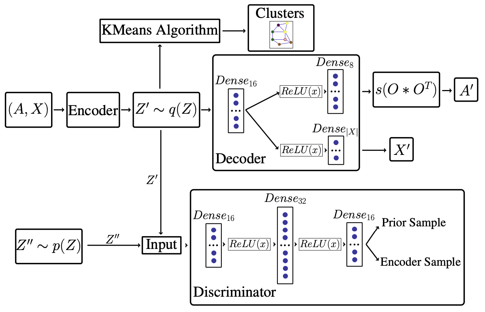
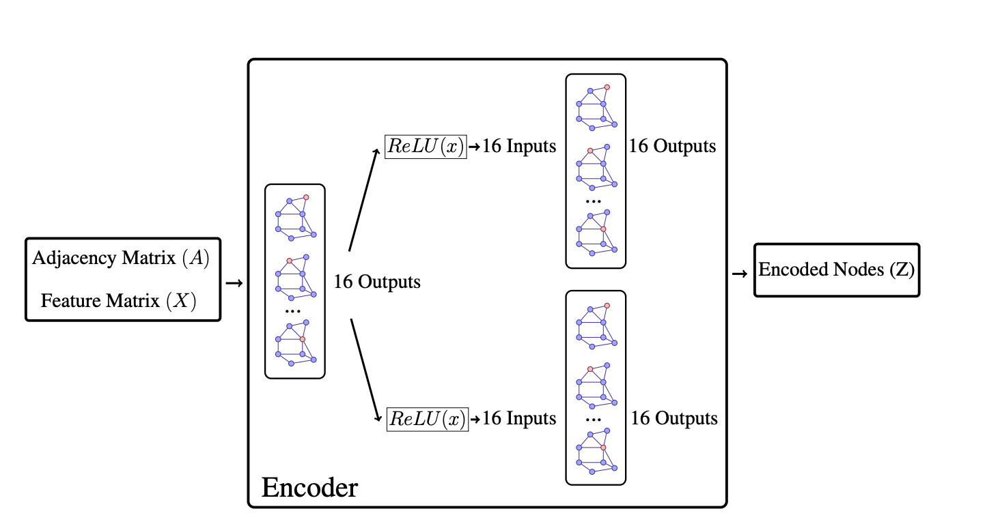

# GraphViNE

This is a pytoch implementation of the GraphViNE model as described in our paper:
F. Habibi, M. Dolati, [Accelerating Virtual Network Embedding with Graph Neural Networks](), 16th International Conference on Network and Service Management.

GraphViNE is a graph neural network(GNN) embedding method for virtual network embedding problem in computer networks. Our method use an adverserially variational graph auto encoder to cluster graph and then embedding request graphs on physical graphs. 

A scheme of our auto encoder can be shown as:

Auto Encoder:


Encoder:


## Requirements
* pytorch
* torch-scatter
* torch-sparse
* torch-cluster
* torch-geometric
* networkx

**Note:** You can easily install requirements by running this command:
```
chmod 755 requirements.sh
./requirements.sh
```

## Run the Demo
```
python compare_main --help
```

## Cite
Please cite our paper if you use this code in your own work:

```
<!-- TODO:PAPER citation -->
```


